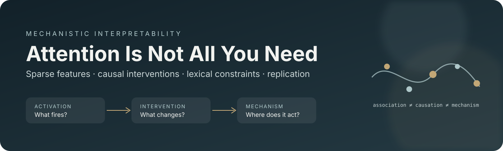

<p align="center">
  
</p>

<p align="center">
  <strong>What activates a feature, what it predicts, and what it causes are different questions.</strong>
</p>

<p align="center">
  <a href="paper/Manuscript.pdf">Read the manuscript</a> ·
  <a href="docs/REPRODUCING.md">Reproduce the study</a> ·
  <a href="replication/claim_ledger.csv">Inspect the claims</a> ·
  <a href="publication/ARTIFACTS.md">Explore the evidence</a>
</p>

<p align="center">
  
  
  
  
</p>

---

## A lexical cue. A causal question.

English chooses **a** or **an** by the sound that follows: *a university*, *an hour*. That small distinction offers a controlled way to ask how a language model uses internal representations to constrain its continuations.

This project studies **Gemma Scope feature 12010**, a residual-stream SAE coordinate in **Gemma 2 2B**, at layer 24 in a 16k dictionary. An earlier phonology probe leaked its label through the article in the input. The revised study separates that failed inference from a different question: **holding the visible prompt fixed, does editing the feature change sound-compatible continuations?**

The completed experiments provide evidence for a narrow, within-model causal effect. They also motivate a prospective replication program across Gemma 3, Llama, and Qwen. The title names the research project; it does not establish that attention is absent or unnecessary.

> **Research status · 8 September 2026**  
> Both saved FP32 trial grids are complete and have been reaggregated from raw records. The data remain candidate-unreviewed and the study exploratory. New pretrained cross-model experiments, independent human adjudication, and public preregistration remain pending. This repository is a publication companion in preparation.

## Evidence at a glance

| Component | Available evidence | Interpretation |
| :--- | :--- | :--- |
| Original dictionary | **30,576 / 30,576** trial-condition records | Complete exploratory grid |
| Alternate dictionary | **30,576 / 30,576** trial-condition records | Same-model dictionary robustness |
| Intervention schedule | **26 conditions**, including 8 random and 4 matched SAE directions | Controls and diagnostics retained |
| Native checks | Exact no-op differences of **0.0 nats** in the saved trial audit | Numerical check, not semantic isolation |
| Cross-model extension | Code for Gemma 3, Llama 3.1, and Qwen3 | Pretrained runs not yet available |

The corrected [coverage audit](replication/outputs/legacy_audit/audit.json) verifies unique records, expected combinations, finite scores, and worker completion. The original `complete: false` report is retained: its checker mistakenly treated worker log files as directories.

### The measured intervention effect

Natural feature removal produces the following spelling-balanced sound contrasts in held-out candidate families:

| Dictionary | Neutral context, after **an** | Cued context, after **an** |
| :--- | ---: | ---: |
| Original | −14.4515 nats | −3.4118 nats |
| Alternate | −12.8354 nats | −3.2845 nats |

A negative value means removal reduces vowel-sound continuation scores relative to consonant-sound continuation scores. These are effects on summed continuation log probabilities, not accuracy percentages. The corresponding original-dictionary **a** estimates are approximately 7.75 × 10⁻⁷ and 1.02 × 10⁻⁸ nats; these near-zero results do not establish equivalence. See the [complete primary table](replication/outputs/legacy_audit/primary_effects_recomputed.csv), [all intervention estimates](replication/outputs/legacy_audit/all_effects_recomputed.csv), and [interpretation limits](docs/CLAIMS.md).

## Four questions, four standards of evidence

| Question | Measurement | What it does not establish by itself |
| :--- | :--- | :--- |
| **What activates it?** | Natural SAE coefficients across contexts | A complete semantic definition |
| **What can it predict?** | Probes with causally available information | Causal importance |
| **What does it change?** | Paired interventions and continuation effects | A uniquely isolated semantic variable |
| **Where does it act?** | Node restoration and controlled path tests | A unique natural circuit |

The [claim ledger](replication/claim_ledger.csv) preserves supported narrow findings, nulls, retired inferences, and unrun hypotheses. In particular, this project does not claim a universal phonology neuron, a proven serial MLP circuit, absence of attention involvement, or a general falsification of vector symbolic architectures.

## Start here

**Read and inspect — no GPU needed.** Begin with the [manuscript](paper/Manuscript.pdf), the [current evidence guide](docs/CLAIMS.md), and the [publication artifact index](publication/ARTIFACTS.md). The manuscripts retain their historical working title and bytes; *Attention Is Not All You Need* is the repository title.

**Check the research package.** Requires Python 3.10 or later; this verifies bytes and notebook payloads without downloading model weights.

```bash
git clone https://github.com/westhauxstripclub/attention-is-not-all-you-need.git
cd attention-is-not-all-you-need
python scripts/verify_artifacts.py
```

**Reproduce Gemma 2 on Kaggle.** Import [Gemma2_Reproduction.ipynb](notebooks/Gemma2_Reproduction.ipynb), choose T4 ×2, enable Internet, and supply `HF_TOKEN` through Kaggle Secrets after obtaining model access. The clean launcher starts with an FP32 smoke run; the larger stages are opt-in. The [executed notebook](replication/evidence/notebook1d8d67f12e.ipynb) is preserved separately with its outputs. Follow the [reproduction guide](docs/REPRODUCING.md) for complete runs and resumption.

**Continue the replication program.** Use [Kaggle_Interpretability_Extension.ipynb](replication/Kaggle_Interpretability_Extension.ipynb) with its GPU stages disabled by default. Complete the [prospective protocol](replication/protocol/PROTOCOL.md), independent reviews, and feature-selection requirements before confirmation.

## Repository map

| Path | Purpose |
| :--- | :--- |
| [`paper/`](paper/) | Rebuilt manuscript in PDF, editable DOCX, and Markdown |
| [`notebooks/`](notebooks/) | Clean, smoke-first Gemma 2 launcher |
| [`experiments/gemma2/`](experiments/gemma2/) | Preserved original implementation, stimuli, audit fixtures, and manuscript sources |
| [`replication/src/`](replication/src/) | Discovery, selection, intervention, path, attention, natural-text, and analysis code |
| [`replication/data/`](replication/data/) | Candidate lexicon, blind review sheets, carriers, crossings, and corpus |
| [`replication/evidence/`](replication/evidence/) | Unchanged raw results archive and executed notebook |
| [`replication/outputs/`](replication/outputs/) | Recomputed legacy tables and historical software/execution records |
| [`publication/`](publication/) | Artifact inventory, provenance, checksums, and submission checklist |

## What comes next

The prospective extension includes **137 lexical candidates**, **18 carriers**, **8 modifier forms**, **1,040 proposed crossings**, and **62 frozen natural-text documents**. These are proposed materials, not independently accepted samples or completed activation maps.

| Model | SAE resource | Current empirical status |
| :--- | :--- | :--- |
| Gemma 3 1B pretrained | Gemma Scope 2 | Not run |
| Llama 3.1 8B base | Llama Scope | Not run |
| Qwen3 1.7B base | Qwen-Scope | Not run |

Each model selects its own feature using separate discovery and selection partitions. Failed selections remain part of the record. Planned analyses include position-specific tracing, controlled MLP paths, grouped attention, and natural-text activation mapping. Exact resources and revisions are in the [model registry](replication/models/registry.json).

A key constraint is linguistic: the ordinary consonant-spelling/vowel-sound cell currently contains only **four independent root families**—*hour, honor, honest, heir*. Derivatives do not create new independent families. The proposed population-inference gate is therefore unmet. See [remaining publication work](publication/CHECKLIST.md).

## Citation and reuse

Until a paper identifier is assigned, cite this repository with the exact commit used and access date. Bibliographic metadata is provided in [`CITATION.cff`](CITATION.cff); no DOI, acceptance, or public registration is implied. The original research has no assigned reuse license in this snapshot. Third-party notices and source attribution are retained; see [NOTICE.md](NOTICE.md).

---

<p align="center"><sub>Measure the association. Test the intervention. Keep the falsification.</sub></p>
